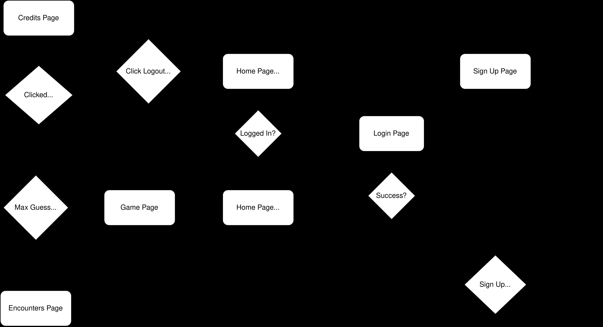

# Guess that Pokemon

## Instructions

### Getting The Game To Run
1. Once the project is cloned, open the SQL Script folder and open and execute the "Full_Database_Script" to build the database required for the game
2. Once the database is created, open the GuessThatPokemon folder and open the .sln file in Visual Studio.
3. Open the solution explorer and right click and select "Configure Startup Projects..."
    - In the pop-up select "Multiple startup projects"
    - Then in the dropdown boxs for "API" and "GuessThatPokemon" select "Start
    - Click "Apply" and the "Ok"
4. Finally click start and you should be good to go.

### How to play

1. Once you launch the app you will be taken to the homepage where you will be greeted and asked to login, if it is your first time either select sign up and then under login select sign up or in the top right corner of the page select sign up.
2. On the Sign Up page you must enter a username of atleast 4 characters and a password that is atleast 9 characters and contains a Uppercase, Number and Special Character. If the username is already taken or password does not conform to the requirements it will take you back to the signup page and prompt you to try again.
3. After you first time playing you can use the same credentials in the login page to login and get back into your account and continue playing.
4. Once you sign up you will be brought back to the home page which will now say play. You can also click Play Game in the nav bar to start playing.
5. Each game you will encounter one of the first 150 Pokemon. You will get a total of 4 tries to capture it by guessing its name correctly. With each try you will be prompted a hint, they start hard but get easier as you guess wrong. You will first be prompted of a place it is located, if it is only acquired through evolution it will say "Evolution". Second you will be given its types, then its abilty and finally you will be shown the outline of its sprite.
6. Once you run out of guesses or guess the Pokemon correctly you will be redirected to the Encounters Page.
7. On the Encounters Page you will be able to scroll through all of your previous games and see which ones you caught or failed to catch. A caught Pokemon is denoted by the sprite being colored in, while a Pokemon that you have not caught will have a blacked out sprite. Encounters are sorted from your most recent encounter to your first encounter.
8. Once you are done you can click the log out button in the top right corner.

## Project Flow

  

